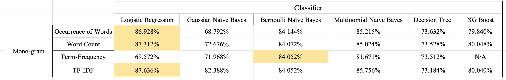
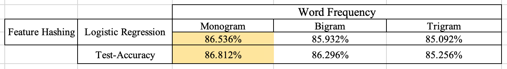

# NLP Project

### This project uses the IMDB movies review dataset to explore and compare the performance of different NLP techniques and algorithms.
 

This project can be divided into 2 parts: 
 

1. Focus SOLELY on Monogram by exploring a couple of different techniques: 
   - Occurrence of Words, Word Count, Term Frequency, Term Frequency-Inverse Document Frequency (TF-IDF)
   - Logistic Regression, Gaussian Naive Bayes, Bernoulli Naive Bayes, Multinomial Naive Bayes, Decision Tree, XG Boost  
   
   - Conclusion: 
      A. Logistic Regression, Bernoulli Naive Bayes & Multinomial Naive Bayes have better performance than the rest of the algorithms.
      B. Logistic Regression performs the best among all the algorithms (has 3/4 categories)
      C. In-terms of Techniques : TF-IDF > Word Count > Occurrence of Words > Feature Hashing (Part 2) > Term-Frequency
      D. Best Accuracy : TF-IDF (Logistic Regression) managed to achieve a validation accuracy of ~ 87.64%
   
 
   
2. Explore Feature Hashing (Fine-Tuning across different number of features) 
   Apply n = 25,000 : Monogram, Bigram, Trigram
   
   - Conclusion: 
      A. Feature Hashing : It's not surprising that the performance increases as the number of features get closer to the original number of features. However, in order to save the space and time, n = 5000 seems like an 'okay' option considering the fact that there's only a drop in accuracy of 1.29%. 
      B. Feature Hashing : It's very interesting to see the drop in accuracy when we decrease the number of features from 5000 to 500. 
  
   
      
      C. Word-Frequency : Originally, I was expecting that bigram & trigram would have a better performance than monogram. However, it seems like I was wrong. I have the opportunity to test the accuracy for mono-gram, bi-gram and tri-gram. Even though there isn't a huge difference in accuracy, monogram still has the best accuracy among these three. 
      
   
   
   

Reference: 
  
Link: https://ai.stanford.edu/~amaas/data/sentiment/
 
@InProceedings{maas-EtAl:2011:ACL-HLT2011, author = {Maas, Andrew L. and Daly, Raymond E. and Pham, Peter T. and Huang, Dan and Ng, Andrew Y. and Potts, Christopher}, title = {Learning Word Vectors for Sentiment Analysis}, booktitle = {Proceedings of the 49th Annual Meeting of the Association for Computational Linguistics: Human Language Technologies}, month = {June}, year = {2011}, address = {Portland, Oregon, USA}, publisher = {Association for Computational Linguistics}, pages = {142--150}, url = {http://www.aclweb.org/anthology/P11-1015} } 

 
